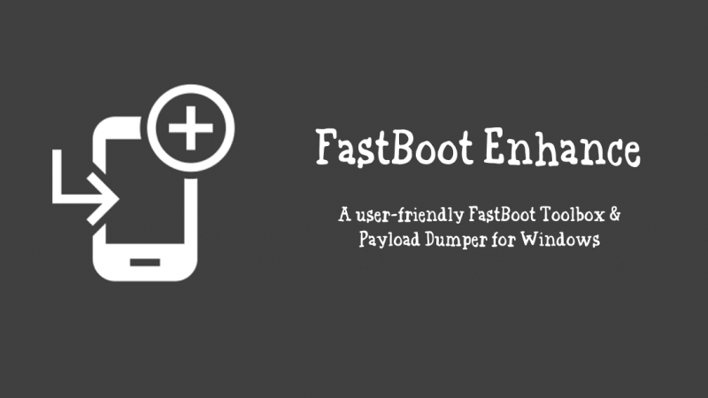
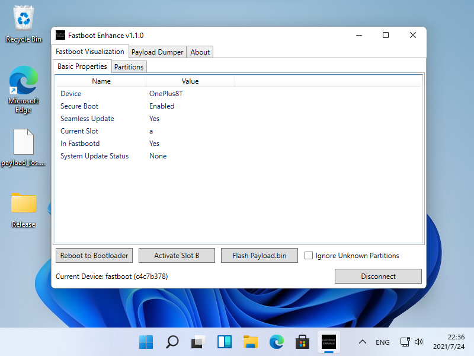
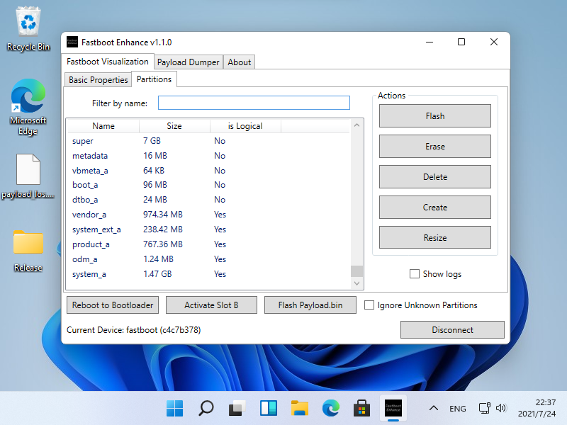
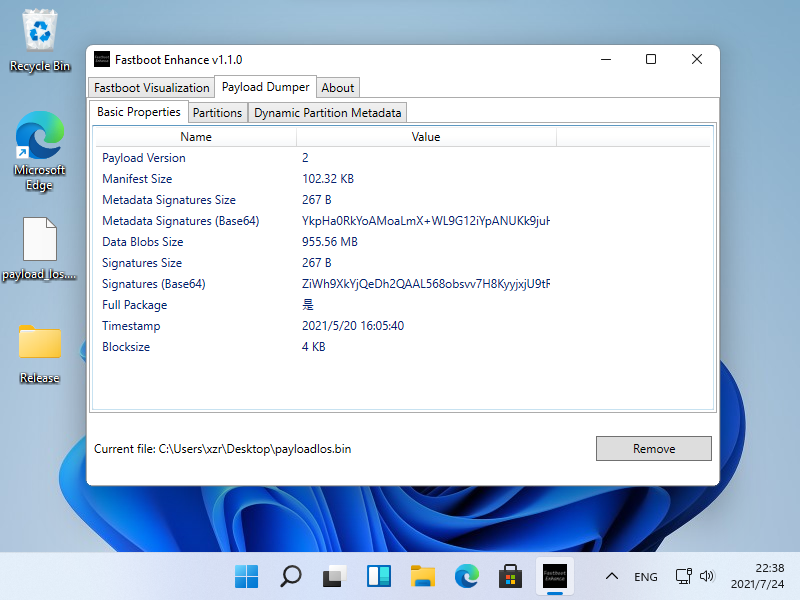

# Fastboot Enhance

 
 

## What can it do?

- Show fastboot vars
- Switch between fastbootd, bootloader, recovery & system
- Switch between A & B slot
- **Flash Payload.bin in fastbootd**
- Flash images
- Erase partitions
- Delete logical partitions
- Create logical partitions
- Resize logical partitions
- Unpack Payload.bin
- **Extract specific image from Payload.bin**
- Show Payload vars
- Show dynamic partition metadata

## Usage

- Make sure `.NET Framework 4.7.2` is supported

- Download `Release.zip` from [Github Releases](https://github.com/xzr467706992/FastbootEnhance/releases)
- Unzip
- Click `FastbootEnhance.exe`

## Note

- Incremental packages are not supported

( I don't have a plan to support it in the future because it is quite useless )

- Still you are able to extract correct image from incremental packages if the checksum passes

( The checksum will be automatically done if "ignore checksum" is not checked )

## Building

- Clone and build it with Visual Studio

## Credits

- [Android Platform Tools](https://developer.android.com/studio/releases/platform-tools)
- [DotNetZip](https://github.com/haf/DotNetZip.Semverd)
- [Protobuf](https://github.com/protocolbuffers/protobuf)
- [XZ.NET](https://github.com/RomanBelkov/XZ.NET)
- [MDIX](https://github.com/MaterialDesignInXAML)
